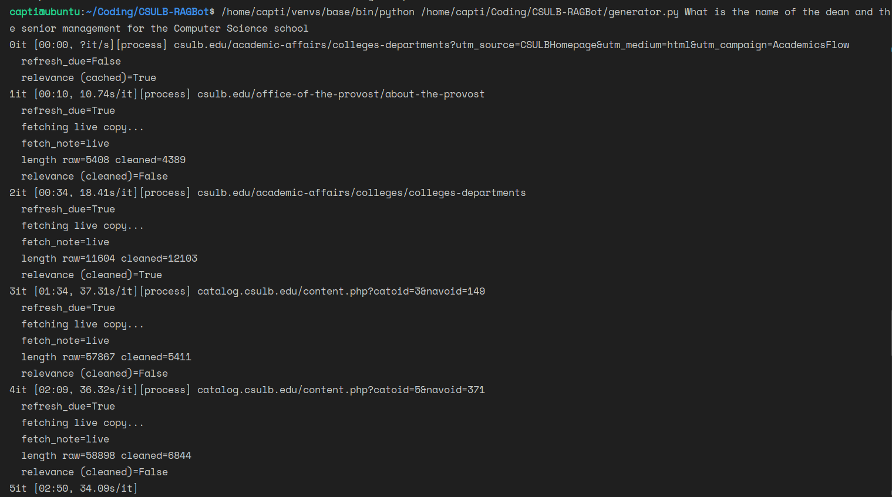
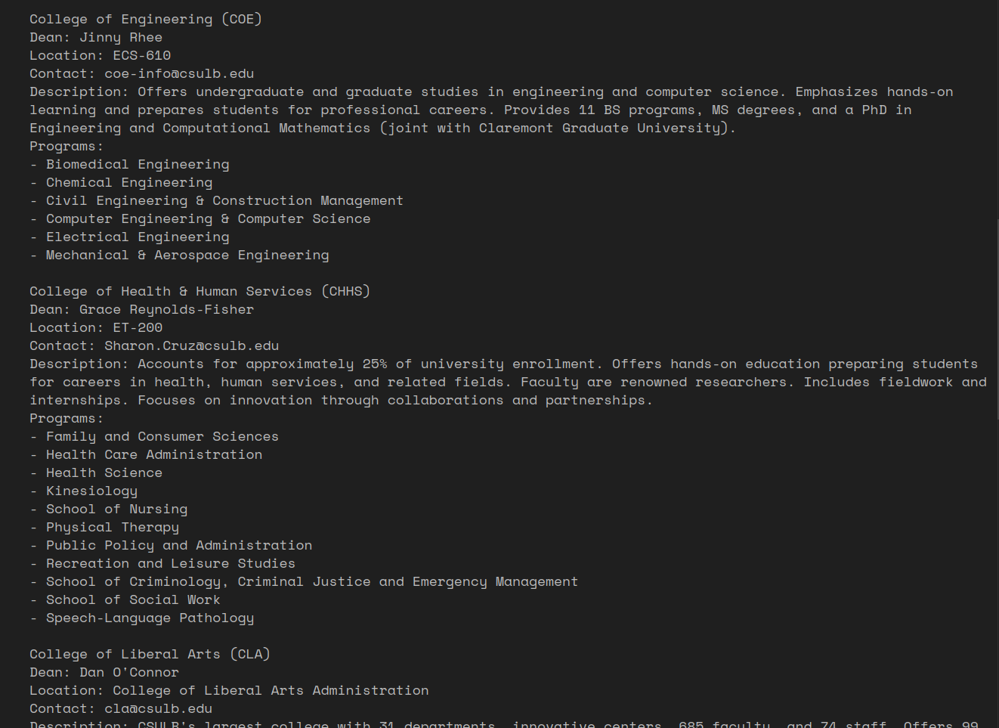

# CSULB-RAGBot
 A LLM able to be ran locally on your own machine and help you by answering your university related questions  by fetching the latest data

# FLOW

- Take input question, retrieve using k=5 from chromadb, map the blocks to the website they were retrieved from.
- now first pass the url and the first 100 words of the local document to a llm and ask it to predict if the retrieved data is relevant
- Get the latest data from the url's that were deemed relvant, and use it to re-index those blocks, and replace the older ones
- Pass the data retrieved into context, and try to answer the question by supplementing from context.
- For any follow up questions, use only the context present unless some other data is needed
- If no relevant documents are found say so
- After the question is anwered llm reflects if the answer is accurate to the question, if not, ask to be specific with the question.

